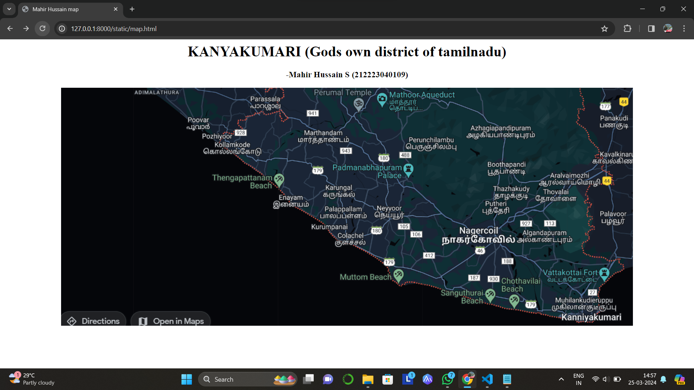
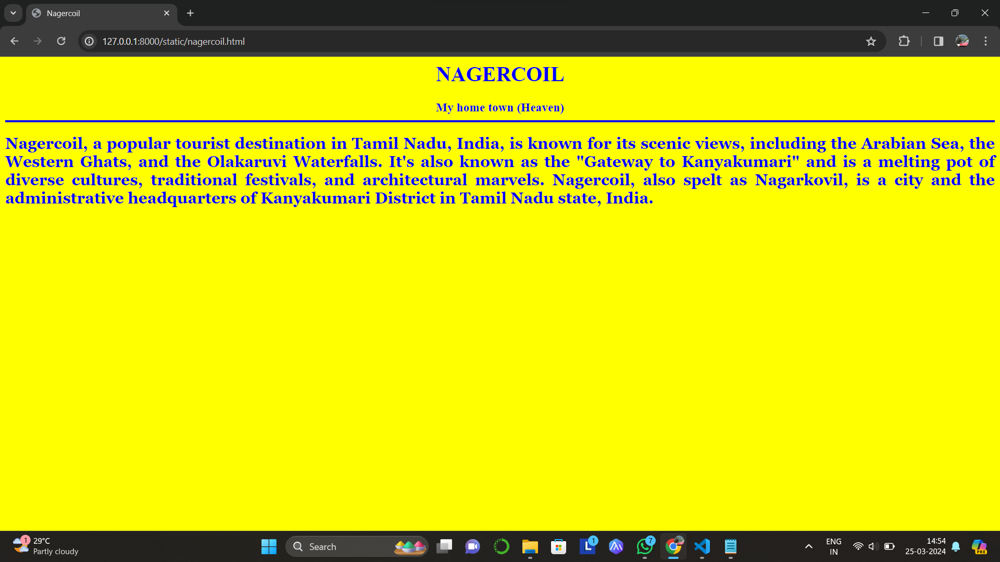
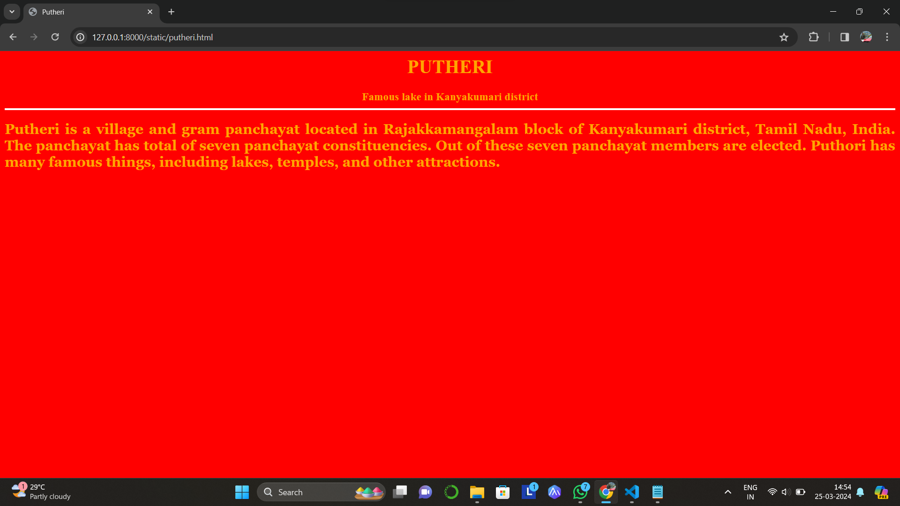
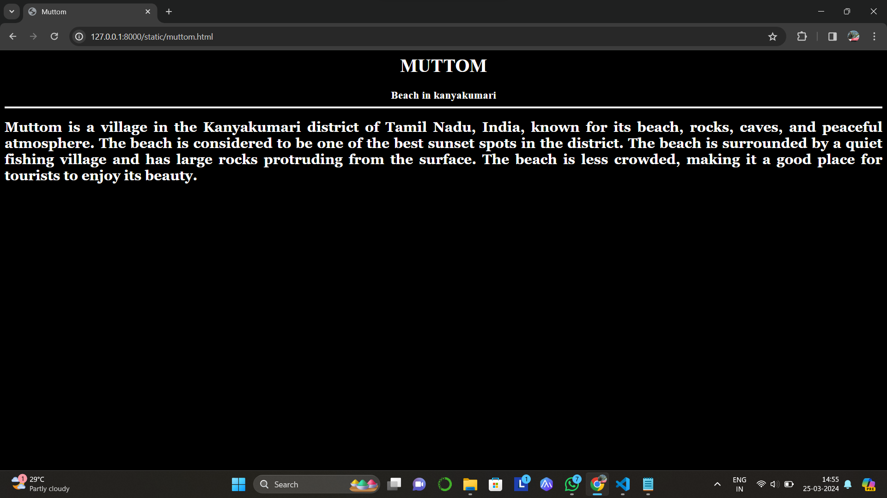
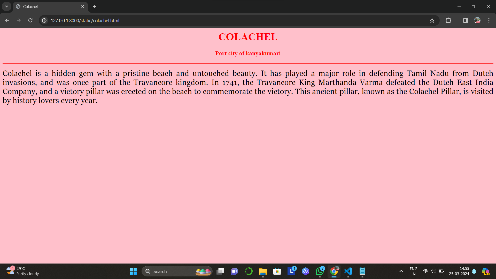
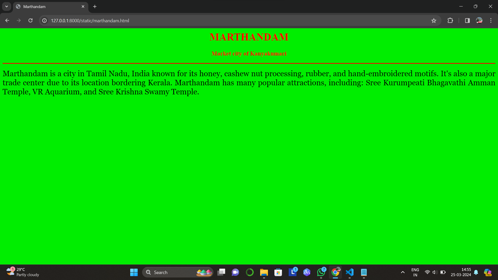

# Ex04 Places Around Me
## Date:22-03-2024 

## AIM
To develop a website to display details about the places around my house.

## DESIGN STEPS

### STEP 1
Create a Django admin interface.

### STEP 2
Download your city map from Google.

### STEP 3
Using ```<map>``` tag name the map.

### STEP 4
Create clickable regions in the image using ```<area>``` tag.

### STEP 5
Write HTML programs for all the regions identified.

### STEP 6
Execute the programs and publish them.

## CODE
```
map.html

<html>
<head>
<title>Mahir Hussain map</title>
</head>
<body align="center">
<h1 align="center">
<font color="black"><b>KANYAKUMARI (Gods own district of tamilnadu)</b></font>
</h1>
<h3 align="center">
<font color="black"><b>-Mahir Hussain S (212223040109)</b></font>
</h3>
   
<map name="image-map">
<area target="" alt="Marthandam" title="Marthandam" href="marthandam.html" coords="518,74,651,138" shape="rect">
<area target="" alt="Colachel" title="Colachel" href="colachel.html" coords="598,308,685,359" shape="rect">
<area target="" alt="Nagercoil" title="Nagercoil" href="nagercoil.html" coords="838,298,1017,358" shape="rect">
<area target="" alt="Putheri" title="Putheri" href="putheri.html" coords="925,244,1007,289" shape="rect">
<area target="" alt="Muttom Beach" title="Muttom Beach" href="muttom.html" coords="599,370,810,453" shape="rect">
</map>
</body>
</html>

nagercoil.html

<html>
<head>
<title>Nagercoil</title>
</head>
<body bgcolor="yellow">
<h1 align="center">
<font color="blue"><b>NAGERCOIL</b></font>
</h1>
<h3 align="center">
<font color="blue"><b>My home town (Heaven)</b></font＞
</h3>
<hr size="3" color="blue">
<p align="justify">
<font face="Georgia" size="5">
    Nagercoil, a popular tourist destination in Tamil Nadu, India, is known for its scenic views, including the Arabian Sea, the Western Ghats, and the Olakaruvi Waterfalls. It's also known as the "Gateway to Kanyakumari" and is a melting pot of diverse cultures, traditional festivals, and architectural marvels.
    Nagercoil, also spelt as Nagarkovil, is a city and the administrative headquarters of Kanyakumari District in Tamil Nadu state, India.

</p>
</body>
</html>

marthandam.html

<html>
<head>
<title>Marthandam</title>
</head>
<body bgcolor=green">
<h1 align="center">
<font color="red"><b>MARTHANDAM</b></font>
</h1>
<h3 align="center">
<font color="red"><b>Market city of Kanyakumari</b></font>
</h3>
<hr size="3" color="red">
<p align="justify">
<font face="Georgia" size="5">
    Marthandam is a city in Tamil Nadu, India known for its honey, cashew nut processing, rubber, and hand-embroidered motifs. It's also a major trade center due to its location bordering Kerala. Marthandam has many popular attractions, including: Sree Kurumpeati Bhagavathi Amman Temple, VR Aquarium, and Sree Krishna Swamy Temple.
    
</p>
</body>
</html>

colachel.html

<html>
<head>
<title>Colachel</title>
</head>
<body bgcolor="pink">
<h1 align="center">
<font color="red"><b>COLACHEL</b></font>
</h1>
<h3 align="center">
<font color="red"><b>Port city of kanyakumari</b></font>
</h3>
<hr size="3" color="red">
<p align="justify">
<font face="Georgia" size="5">
    Colachel is a hidden gem with a pristine beach and untouched beauty. It has played a major role in defending Tamil Nadu from Dutch invasions, and was once part of the Travancore kingdom. In 1741, the Travancore King Marthanda Varma defeated the Dutch East India Company, and a victory pillar was erected on the beach to commemorate the victory. This ancient pillar, known as the Colachel Pillar, is visited by history lovers every year. 

</p>
</body>
</html>

muttom.html

<html>
<head>
<title>Muttom</title>
</head>
<body bgcolor="black">
<h1 align="center">
<font color="white"><b>MUTTOM</b></font>
</h1>
<h3 align="center">
<font color="white"><b>Beach in kanyakumari</b></font＞
</h3>
<hr size="3" color="white">
<p align="justify">
<font face="Georgia" size="5">
    Muttom is a village in the Kanyakumari district of Tamil Nadu, India, known for its beach, rocks, caves, and peaceful atmosphere. The beach is considered to be one of the best sunset spots in the district. The beach is surrounded by a quiet fishing village and has large rocks protruding from the surface. The beach is less crowded, making it a good place for tourists to enjoy its beauty.
    
</p>
</body>
</html>

putheri.html

<html>
<head>
<title>Putheri</title>
</head>
<body bgcolor="red">
<h1 align="center">
<font color="orange"><b>PUTHERI</b></font>
</h1>
<h3 align="center">
<font color="orange"><b>Famous lake in Kanyakumari district</b></font＞
</h3>
<hr size="3" color="white">
<p align="justify">
<font face="Georgia" size="5">
    Putheri is a village and gram panchayat located in Rajakkamangalam block of Kanyakumari district, Tamil Nadu, India. The panchayat has total of seven panchayat constituencies. Out of these seven panchayat members are elected.
    Puthori has many famous things, including lakes, temples, and other attractions. 

</p>
</body>
</html>
```
## OUTPUT






## RESULT
The program for implementing image maps using HTML is executed successfully.
